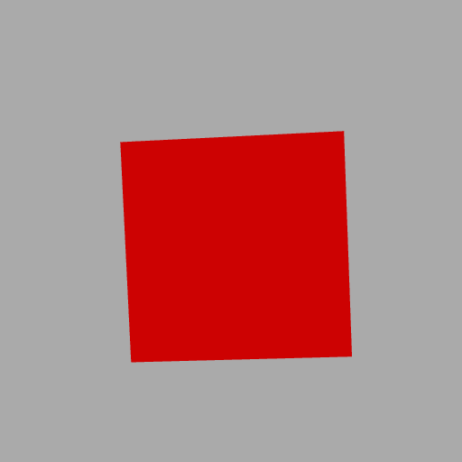
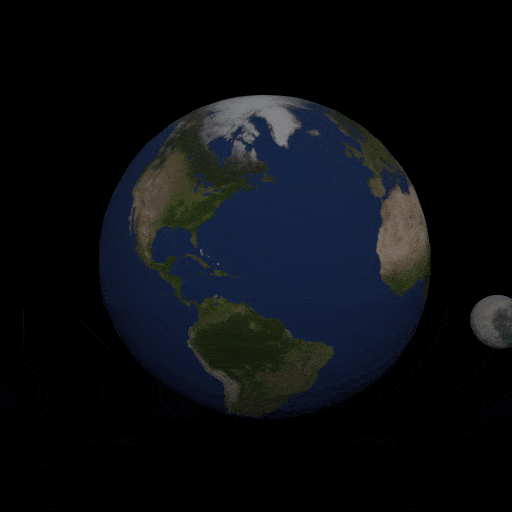

<body>

<h1>WebGameDevelopmentWithThreeJS</h1>

 3D Web Game Development With Three JS Scripts and Course Materials 

 

<h4>Dogukan Kaan Bozkurt</h4>

 Server host : https://simplewebserver.org/

 ThreeJS Editor : https://threejs.org/editor/

<h2> PROJECTS</h2>

  

    
  

  

    
  

  

    
  

 Rotating Red Cude 

 

 Earth and Moon 

</body>
</html>
